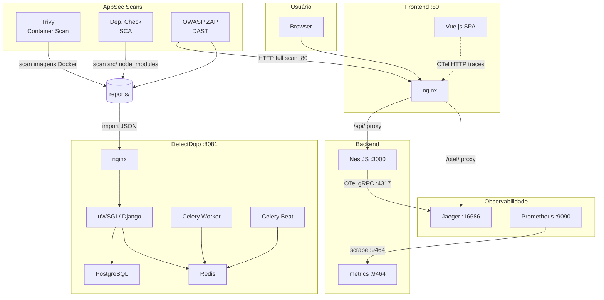

# AppSec Palestra — Calculadora de IMC


Repositório didático para palestra sobre **Application Security (AppSec)**, demonstrando como integrar segurança ao ciclo de desenvolvimento de uma aplicação real.

## Visão Geral

Aplicação de cálculo de IMC (Índice de Massa Corporal) construída com boas práticas de desenvolvimento e ferramentas de segurança integradas ao pipeline.

## Etapas do Projeto

| # | Etapa | Status |
|---|-------|--------|
| 1 | Backend NestJS com Swagger, OpenTelemetry e Prometheus | ✅ Concluído |
| 2 | Frontend Vue.js com OpenTelemetry Web | ✅ Concluído |
| 3 | Testes (backend + frontend) | ✅ Concluído |
| 4 | AppSec (Trivy, OWASP ZAP, Dependency Check, DefectDojo) | ✅ Concluído |

---

## Arquitetura e Comunicação dos Serviços



---

## Etapa 1 — Backend

### Stack

- **Runtime:** Node.js 22
- **Framework:** NestJS 11
- **Documentação:** Swagger (`@nestjs/swagger`)
- **Validação:** `class-validator` + `class-transformer`
- **Observabilidade:** OpenTelemetry SDK (traces via OTLP → Jaeger) + Prometheus (`prom-client`)
- **Health check:** `@nestjs/terminus`

### Estrutura

```
backend/
├── src/
│   ├── bmi/
│   │   ├── dto/
│   │   │   ├── calculate-bmi.dto.ts   # Validação de entrada (weight, height)
│   │   │   └── bmi-result.dto.ts      # Shape da resposta
│   │   ├── bmi.controller.ts          # POST /bmi/calculate
│   │   ├── bmi.service.ts             # Lógica de cálculo + métricas
│   │   └── bmi.module.ts
│   ├── health/
│   │   ├── health.controller.ts       # GET /health
│   │   └── health.module.ts
│   ├── telemetry/
│   │   └── telemetry.ts               # Bootstrap OpenTelemetry + OTLP exporter
│   ├── app.module.ts
│   └── main.ts                        # Bootstrap NestJS + Swagger + ValidationPipe
├── Dockerfile                         # Multi-stage build (builder + production)
└── package.json
```

### Endpoints

| Método | Rota | Descrição |
|--------|------|-----------|
| `POST` | `/bmi/calculate` | Calcula o IMC |
| `GET` | `/health` | Health check da aplicação |
| `GET` | `/api/docs` | Swagger UI |
| `GET` | `:9464/metrics` | Métricas Prometheus (porta separada) |

### Exemplo de uso

**Request:**
```json
POST /bmi/calculate
{
  "weight": 70,
  "height": 1.75
}
```

**Response:**
```json
{
  "bmi": 22.86,
  "classification": "Normal weight",
  "weight": 70,
  "height": 1.75
}
```

### Classificações de IMC (OMS)

| IMC | Classificação |
|-----|---------------|
| < 16 | Magreza grave |
| 16 – 18.4 | Abaixo do peso |
| 18.5 – 24.9 | Peso normal |
| 25 – 29.9 | Sobrepeso |
| 30 – 34.9 | Obesidade grau I |
| 35 – 39.9 | Obesidade grau II |
| ≥ 40 | Obesidade grau III |

### Métricas Prometheus

| Métrica | Tipo | Descrição |
|---------|------|-----------|
| `bmi_calculations_total` | Counter | Total de cálculos por classificação |
| `bmi_value_distribution` | Histogram | Distribuição dos valores de IMC |

### Executar localmente

```bash
cd backend
npm run start:dev   # desenvolvimento com hot reload
npm run build && npm run start:prod
```

---

## Etapa 2 — Frontend

### Stack

- **Framework:** Vue.js 3 (Composition API)
- **Build tool:** Vite
- **Linguagem:** TypeScript
- **HTTP client:** Axios
- **Roteamento:** Vue Router
- **Testes:** Vitest
- **Observabilidade:** OpenTelemetry Web SDK (traces → Jaeger via proxy nginx)

### Estrutura

```
frontend/
├── src/
│   ├── components/
│   │   ├── BmiForm.vue        # Formulário de entrada (peso + altura)
│   │   └── BmiResult.vue      # Exibição do resultado com cor por classificação
│   ├── composables/
│   │   └── useBmi.ts          # Estado reativo + chamada à API
│   ├── services/
│   │   └── bmi.service.ts     # Axios client para POST /bmi/calculate
│   ├── types/
│   │   └── bmi.types.ts       # Interfaces TypeScript (BmiRequest, BmiResult)
│   ├── views/
│   │   └── HomeView.vue       # Página principal orquestrando os componentes
│   ├── telemetry.ts           # Bootstrap OpenTelemetry Web SDK
│   ├── router/index.ts
│   └── main.ts
├── Dockerfile                 # Multi-stage: Vite build + Nginx
├── nginx.conf                 # SPA fallback + proxy /api/ + proxy /otel/
├── .env                       # VITE_API_URL=http://localhost:3000
└── .env.production            # VITE_API_URL=/api
```

### Proxy nginx

| Rota nginx | Destino | Finalidade |
|-----------|---------|------------|
| `/` | arquivos estáticos | SPA Vue.js |
| `/api/` | `http://backend:3000/` | Chamadas à API |
| `/otel/` | `http://jaeger:4318/` | Traces do browser → Jaeger |

### Executar localmente

```bash
cd frontend
npm run dev        # http://localhost:5173
npm run build      # build de produção
```

---

## Etapa 3 — Testes

### Backend (Jest)

| Suíte | Testes | O que cobre |
|-------|--------|-------------|
| `bmi.service.spec.ts` | 9 | Todas as 7 classificações + valor BMI + campos retornados |
| `bmi.controller.spec.ts` | 3 | Definição, resultado correto, delegação ao service |
| `app.e2e-spec.ts` | 6 | POST /bmi/calculate (sucesso + 4 validações); GET /health |

```bash
cd backend
npm test              # unit tests
npm run test:e2e      # e2e tests
npm run test:cov      # coverage report
```

### Frontend (Vitest)

| Suíte | Testes |
|-------|--------|
| `BmiForm.spec.ts` | Renderização e envio do formulário |
| `BmiResult.spec.ts` | Exibição, cores por classificação, evento reset |
| `bmi.service.spec.ts` | Chamada à API via Axios |
| `useBmi.spec.ts` | Composable: estados loading/error/result |

```bash
cd frontend
npm run test:unit           # executa uma vez
npm run test:unit -- --watch  # modo watch
```

---

## Etapa 4 — AppSec

### Arquitetura

```
                    ┌─────────────────┐
                    │   GitHub CI /   │
                    │   Execução local│
                    └────────┬────────┘
           ┌─────────────────┼─────────────────┐
           ▼                 ▼                 ▼
   ┌──────────────┐  ┌──────────────┐  ┌──────────────┐
   │    Trivy     │  │  Dep. Check  │  │  OWASP ZAP   │
   │  Container   │  │     SCA      │  │     DAST     │
   │    Scan      │  │              │  │              │
   └──────┬───────┘  └──────┬───────┘  └──────┬───────┘
          └─────────────────┼─────────────────┘
                            ▼
                    ┌───────────────┐
                    │  DefectDojo   │
                    │  (Aggregator) │
                    └───────────────┘
```

### Ferramentas

| Ferramenta | Tipo | O que analisa |
|-----------|------|---------------|
| **Trivy** | Container Scan | CVEs nas imagens Docker `appsec-bmi-backend` e `appsec-bmi-frontend` |
| **OWASP Dependency Check** | SCA | Vulnerabilidades em dependências npm (backend + frontend) |
| **OWASP ZAP** | DAST | Vulnerabilidades HTTP em runtime (full scan) |
| **DefectDojo** | Aggregator | Centraliza, prioriza e gerencia todos os findings |

### Stack completa

```
docker compose up -d
```

| Serviço | URL | Credenciais |
|---------|-----|-------------|
| Frontend | http://localhost | — |
| Backend | http://localhost:3000 | — |
| Swagger UI | http://localhost:3000/api/docs | — |
| Prometheus metrics | http://localhost:9464/metrics | — |
| Prometheus | http://localhost:9090 | — |
| Jaeger UI | http://localhost:16686 | — |
| DefectDojo | http://localhost:8081 | admin / admin@dojo123 |

### Serviços DefectDojo

O DefectDojo utiliza uma stack completa para funcionar corretamente:

| Container | Função |
|-----------|--------|
| `postgres` | Banco de dados PostgreSQL |
| `redis` | Broker de tarefas Celery |
| `defectdojo-initializer` | Executa migrations e cria admin (roda uma vez) |
| `uwsgi` | Aplicação Django via uWSGI |
| `defectdojo-nginx` | Serve assets estáticos + proxy para uWSGI |
| `defectdojo-celeryworker` | Processa tarefas em background (imports) |
| `defectdojo-celerybeat` | Agendamento de tarefas periódicas |

### Executar os scans

```bash
# Build das imagens com nomes fixos (necessário para o Trivy)
docker compose build backend frontend

# Scans individuais
make trivy          # escaneia imagens Docker
make dep-check      # analisa dependências npm
make zap            # DAST contra http://localhost

# Todos de uma vez
make scan-all
```

Os relatórios são gerados em `reports/` (JSON + HTML).

### Importar findings no DefectDojo

> **Pré-requisito:** aguarde o DefectDojo inicializar completamente antes de rodar o setup.
> O container `defectdojo-initializer` precisa concluir a migração do banco. Verifique com
> `docker compose logs -f defectdojo-initializer` e aguarde a mensagem de conclusão,
> ou acesse http://localhost:8081 — quando a tela de login aparecer, está pronto.

```bash
# Passo 1: criar produto e engagements no DefectDojo
make setup-dojo
```

O script cria automaticamente o produto **BMI AppSec** e três engagements dedicados:

| Engagement | Ferramenta | Tipo |
|-----------|-----------|------|
| `Container Scan - Trivy` | Trivy | CI/CD |
| `SCA - Dependency Check` | OWASP Dep. Check | CI/CD |
| `DAST - OWASP ZAP` | OWASP ZAP | CI/CD |

```bash
# Passo 2: exportar as variáveis exibidas pelo setup
export DOJO_TOKEN=<token>
export DOJO_ENG_TRIVY=<id>
export DOJO_ENG_DEPCHECK=<id>
export DOJO_ENG_ZAP=<id>

# Passo 3: rodar os scans e importar automaticamente
make scan-all-dojo
```

### Pipeline GitHub Actions

O arquivo `.github/workflows/appsec.yml` executa automaticamente em push/PR para `main`:

| Job | Ferramenta | Ação |
|-----|-----------|------|
| `test` | Jest + Vitest | Valida que nenhum teste quebrou |
| `dependency-check` | OWASP Dep. Check | SCA das dependências npm |
| `trivy` | Trivy | Scan das imagens backend e frontend |
| `zap` | OWASP ZAP | DAST contra o stack completo |

Todos os relatórios são salvos como artefatos no GitHub Actions e importados no DefectDojo quando os secrets `DEFECTDOJO_URL`, `DEFECTDOJO_TOKEN`, `DEFECTDOJO_ENG_TRIVY`, `DEFECTDOJO_ENG_DEPCHECK` e `DEFECTDOJO_ENG_ZAP` estiverem configurados.

---

## Observabilidade

### Traces distribuídos (Jaeger v2)

O projeto instrumenta **backend e frontend** com OpenTelemetry, correlacionando spans entre camadas:

- **`bmi-backend`** — traces das requisições HTTP via auto-instrumentação NestJS
- **`bmi-frontend`** — traces das chamadas fetch/axios via `FetchInstrumentation`

O frontend envia traces para `/otel/v1/traces` (mesmo origin), o nginx faz proxy para `http://jaeger:4318/v1/traces` evitando CORS.

### Métricas (Prometheus)

O backend expõe métricas na porta `:9464` (porta separada — boa prática cloud-native para não expor métricas publicamente). O Prometheus faz scrape a cada 15s.

---

## Princípios Aplicados

| Princípio | Como foi aplicado |
|-----------|------------------|
| **SOLID** | Cada classe tem responsabilidade única (Service, Controller, DTO separados) |
| **MVC** | Controller → Service → DTO |
| **Validação na borda** | `ValidationPipe` global com `whitelist: true` e `transform: true` |
| **Container seguro** | Imagem `node:22-alpine`, usuário `node` (não-root), multi-stage build |
| **Métricas em porta separada** | `:9464` não exposta publicamente, apenas para o Prometheus interno |
| **Observabilidade distribuída** | Traces correlacionados entre frontend e backend via W3C TraceContext |
| **Segurança contínua** | Scans automáticos (SCA, container, DAST) em cada push via GitHub Actions |
